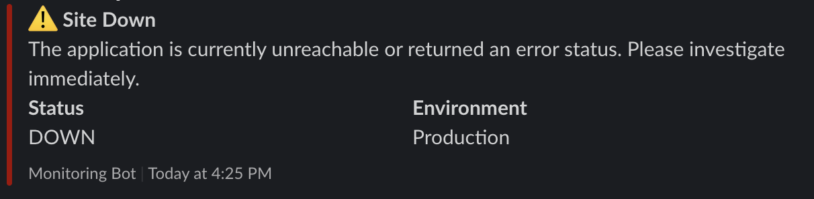
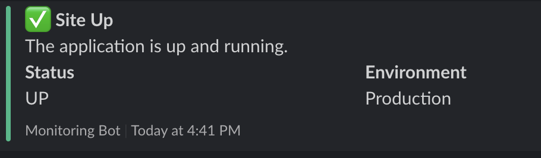
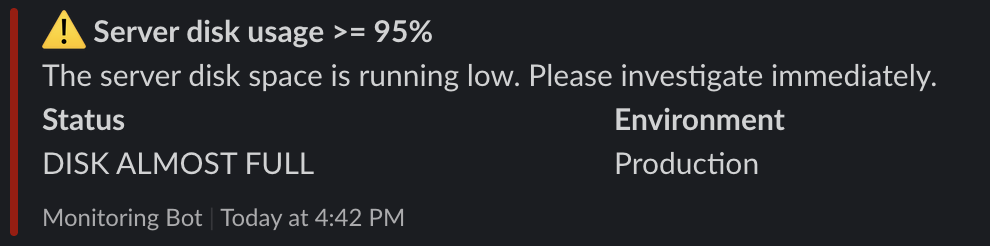

# Site Health Check

This bash script sends slack notification when the site is down, and server storage is full.

## Usage

```bash
./health_check.sh <site_url> <slack_webhook_url>
```

## Setup cron job

1. Use crontab to edit the existing cronjobs for current user

```bash
crontab -e
```

2. Make `health_check.sh` an executable

```bash
chmod u+x ./health_check.sh
```

3. Use this to trigger cronjob every 5 minutes

```bash
*/5 * * * *        /path/to/health_check.sh <site_url> <slack_webhook_url>
```

## Screenshots




